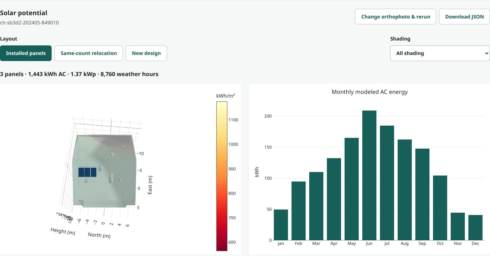

# Shading-aware PV

[Paper (TODO)](TODO_PAPER_URL) · [API reference](#api-reference) · [Citation](#citation)

## Overview

Estimate rooftop solar yield and panel placement with shading from terrain, roof details, neighboring buildings, and vegetation. Compare installed panels, relocation, and new layouts in an interactive 3D view.

Built on [Emboss](https://github.com/tobiasvonarx/emboss), included as a pinned Git submodule. Building acquisition currently supports Switzerland.



## Installation

Install [uv](https://docs.astral.sh/uv/), GDAL **3.13.0** with development headers (`gdal-config` on `PATH`), and a C/C++ compiler. Shading also requires an EGL-capable OpenGL driver. A CUDA GPU speeds up reconstruction.

```bash
git clone --recurse-submodules https://github.com/tobiasvonarx/shading-aware-pv.git
cd shading-aware-pv
uv sync --locked
cp .env.example .env
```

uv installs the project's Python version and locked dependencies in a separate environment. If GDAL is outside the standard library path, set `NATIVE_PREFIX` in `.env` to its installation directory.

## Getting started

From the repository directory, run:

```bash
uv run --locked shading-aware-pv
```

Open **http://127.0.0.1:5002**.

1. In **Find buildings**, search for an address or select an area, then prepare the buildings.
2. Choose one building or the whole selection and the weather year. Electrical and neighborhood options are under **Advanced settings**.
3. Select **Review orthophotos**, compare the available images, and confirm an image for each building to start analysis.
4. Use **My analyses** to open reports, explore shading and monthly energy, download JSON, or remove and restore saved analyses.

In **New design**, move the panel-count slider from zero to roof capacity. The layout, capacity, and energy chart update as you move it. Older reports need a one-time preparation before the slider becomes available.

Placement uses exposed scaffold roof surfaces only, excluding covered lower roofs and all roof-detail tops, including dormers. Full geometry remains available for shading and independent placement checks. Reports from method revisions before 8 should be rerun; their saved results remain available.

Adjacent roof pieces join across split edges within 1 mm, retaining the 3° normal-angle limit. Installed-panel fitting allows 1 cm of support-boundary mismatch and checks support and obstructions before scoring grid fits. These tolerances do not relax new-design setbacks or permit obstruction penetration.

The app downloads model weights, neighboring LiDAR tiles, PVGIS weather, and available snow observations. Allow about 13 GB for the Swiss building dataset, plus cached inputs. Bare-roof placement estimates exclude snow losses.

Data and results are saved in `./data`. Edit [.env](.env.example) to change `PORT`, `DATA_DIR`, `WORKERS`, and `DEVICE`, then restart.

## API reference

### Python

Save this as `example.py` and run `uv run --locked python example.py`. GDAL must be available on Python's library path.

```python
from pathlib import Path
from emboss.api import Client
from shading_aware_pv.inputs import SimulationInputs
from shading_aware_pv.simulation import SimulationConfig, simulate, write_result

client = Client("./data", workers=2)
selection = client.store.acquire({
    "mode": "house",
    "longitude": 7.055825,
    "latitude": 46.779828,
})
house_id = selection["houses"][0]
reconstruction = client.reconstruct(house_id)
year = 2023

inputs = SimulationInputs.from_reconstruction(
    reconstruction,
    Path("data/solar/weather") / house_id / str(year),
)
result = simulate(inputs, SimulationConfig(year=year))
write_result(result, Path("solar-result.json"))
```

Keep weather caches separate for each house and year. `SimulationInputs` also accepts explicit mesh, roof-detail GeoJSON, orthophoto, and scaffold paths. Pass a `SimulationConfig` to change the weather year, neighborhood extent, panel dimensions, or electrical assumptions.

### HTTP

Start the app first. [Interactive API documentation](http://127.0.0.1:5002/docs) describes all endpoints. Acquire buildings through the map or `POST /api/acquisition`; `GET /api/houses` lists their IDs.

In the UI, **Review orthophotos** opens the shared Emboss gallery. Compare the flight strips with the roof footprint, confirm each building in a batch, then start analysis. A saved report’s **Change orthophoto & rerun** keeps that report’s analysis settings and creates a new run; the previous report remains available.

Analyze one or more acquired buildings:

```bash
curl -X POST http://127.0.0.1:5002/api/solar/runs \
  -H 'Content-Type: application/json' \
  -d '{"houses":["HOUSE_ID"],"config":{"year":2023}}'
```

Optional `"image_choices":{"HOUSE_ID":"CANDIDATE_ID"}` selects a particular orthophoto. Both batch and single-house solar endpoints accept this map. An omitted entry preserves the building’s existing choice; an explicit `null` resets it to automatic selection. Choices are recorded with the run and its jobs; scientific result JSON keeps its existing format.

Replace `HOUSE_ID` with an acquired ID. The response includes the run ID and individual jobs. Use them to poll progress and download results:

```bash
curl http://127.0.0.1:5002/api/solar/runs/RUN_ID
curl http://127.0.0.1:5002/api/solar/jobs/JOB_ID/result -o solar-result.json
```

| Method | Endpoint | Purpose |
| --- | --- | --- |
| POST | `/api/houses/HOUSE_ID/imagery` | Prepare available orthophotos for review |
| GET | `/api/imagery-jobs/JOB_ID` | Poll imagery preparation; read candidate IDs |
| GET | `/api/houses/HOUSE_ID/imagery/preview?candidate_id=ID` | Read a candidate preview |
| GET | `/api/solar/config` | Read numerical defaults |
| GET | `/api/solar/runs` | List saved runs |
| GET | `/api/solar/runs/RUN_ID` | Read per-building progress and failures |
| GET | `/api/solar/jobs` | List individual jobs |
| GET | `/api/solar/jobs/JOB_ID` | Read a job's status |
| GET | `/api/solar/jobs/JOB_ID/result` | Download a completed result |
| POST | `/api/solar/jobs/JOB_ID/counts` | Prepare adjustable panel counts for a saved report |
| GET | `/api/solar/jobs/JOB_ID/counts` | Poll panel-count preparation |
| GET | `/api/solar/jobs/JOB_ID/counts/result` | Read the separate prepared report |
| DELETE | `/api/solar/runs/RUN_ID` | Remove a finished run from the list |
| DELETE | `/api/solar/jobs/JOB_ID` | Remove an individual finished report |
| GET | `/api/solar/trash` | List removed runs and reports |
| POST | `/api/solar/runs/RUN_ID/restore` | Undo run removal |
| POST | `/api/solar/jobs/JOB_ID/restore` | Undo report removal |

New reports include `designs_by_count` for every count from zero to the feasible maximum. Each smaller count uses a fixed-count MILP and a fresh yield calculation; its monthly data and panel geometry are available immediately to the slider. The maximum preserves the original clean-slate design. Extra count entries omit hourly arrays to limit report size. Python callers can pass `include_count_designs=False` to `simulate` when interactive results are unnecessary.

Older reports prepare their variants once from the retained reconstruction and cached weather, snow, and LiDAR inputs. Preparation writes a separate result and retains the original. A changed reconstruction or missing cache requires a new analysis. Reports from an earlier method revision are recalculated with the current method; same-revision preparation verifies that the retained inputs reproduce the saved baseline.

The batch shares one configuration; a failed house does not stop the others. Resubmit jobs interrupted by an application shutdown.

Use **Remove run** or a report's **Remove** button to clear saved analyses. **Removed items → Undo** restores them, including after restarting the app. Removal retains the original files and records a reversible archive marker. Active runs and reports return HTTP 409; wait for them to finish. Removing a run keeps previously removed reports removed; undo the run first to restore those reports individually. Building inputs and other runs are unaffected.

### Outputs

The result JSON contains the building mesh, roof irradiation samples, panel layouts, hourly and monthly energy, electrical assumptions, and source metadata. `designs` includes `installed`, `relocated`, and `clean_slate` when available. Same-count relocation searches generated and imagery-inferred panel positions together, allowing a mix of retained and moved panels. The proposal must improve full-shading modeled AC energy with identical electrical inputs; otherwise the inferred layout is retained. Clean-slate designs use their original candidate pool. Each design reports energy for six shading states, and identifies whether snow losses were applied. Bare roofs produce a snow-free placement estimate.

## Citation

TODO: add the paper citation and BibTeX entry.
